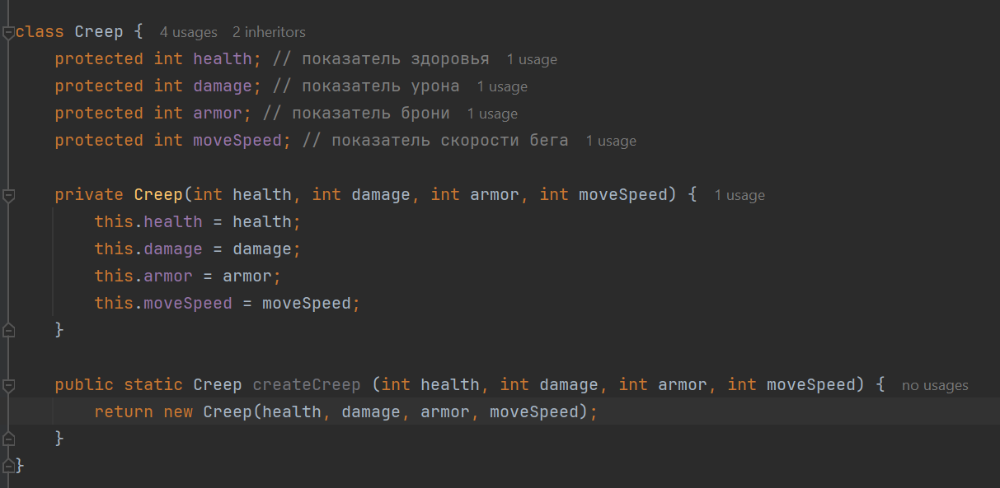

# 8. ООП и интерфейсы:

### Задание 3.1:

1). 

2). 

3).  // все примеры взяты из одного задания, последний практически в исходном виде, за исключением переименованных мною полей классов на более наглядные. Понимаю, что сам класс перегружен количеством полей, но я посчитал честным оставить это в исходном виде, и взять в качестве примера именно написанный мною код, пусть и не лучшего вида.

### Задание 3.2:

Не использовал